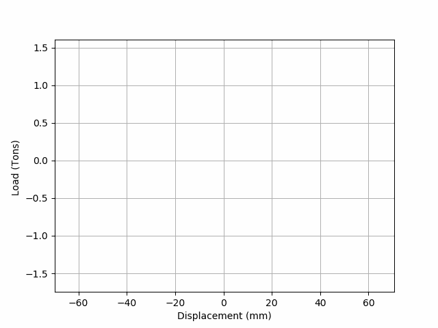
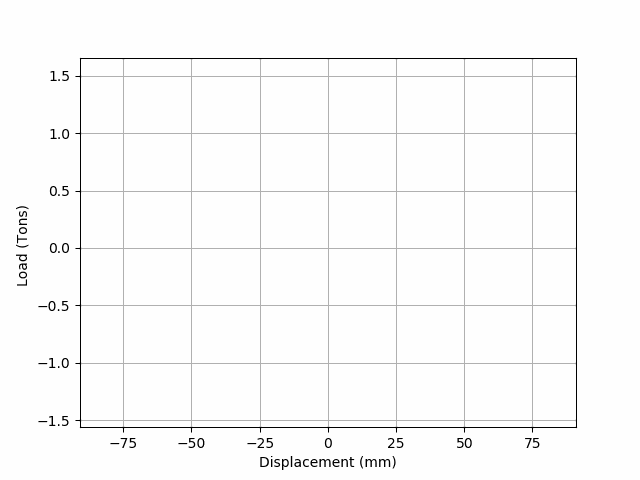
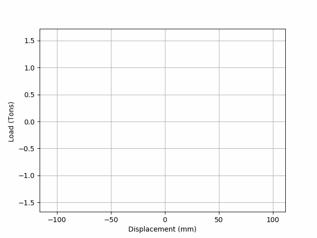
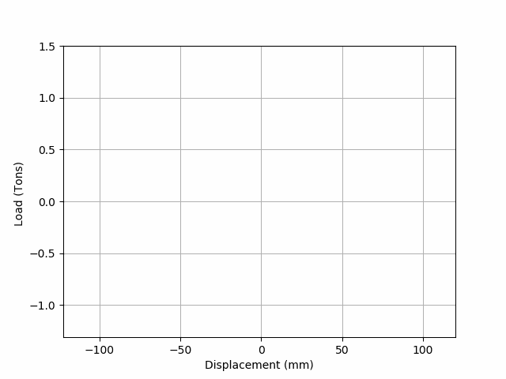
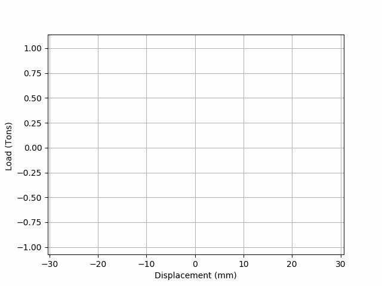
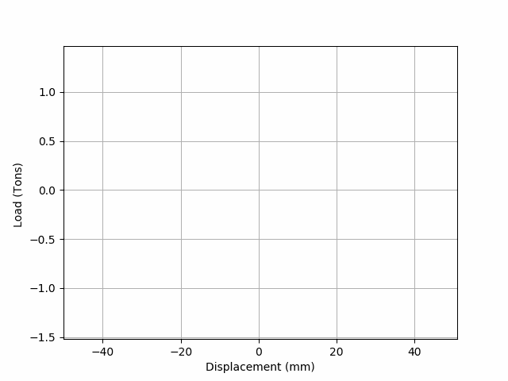

# Toolkit-for-Displacement-Hysteresis-Visualization
  Hysterisis data manipulation and visualization toolkit is an effort to represent the data intuitively. A side project is to train artificial neural networks to predict the plot for arbitrary loads, displacement or cycle within range.
# Possible Visulization Methods being Implemented:
## Animated Data
[Animated Data Website](https:///QuantumNovice.github.io/Data-Visualization-of-Load-Displacement-Hysteresis)

## Fourier Transform
## Slinky Spring
## Compressible Fluid
## As a Building Model
