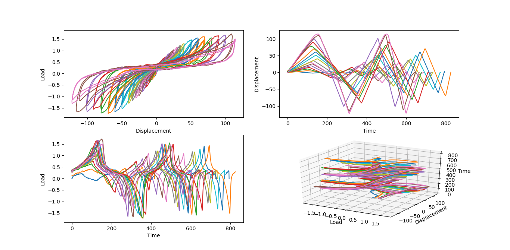
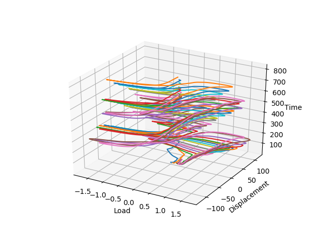

The source code is inside Python-Extraction-and-Plotting-from-Excel-Sheets.
# Usage
## plotter_animated.py
This plots "Wall No.3_ Data.xls" below row 6 and every two columns are plotted on a graph.
!()[https://github.com/QuantumNovice/Data-Visualization-of-Load-Displacement-Hysteresis]
# Project Details
## Toolkit-for-Displacement-Hysteresis-Visualization
  Hysterisis data manipulation and visualization toolkit is an effort to develop programs to represent the data intuitively. A side project is to train artificial neural networks to predict the plot for arbitrary loads, displacement or cycle within data range.

# Possible Visulization Methods being Implemented:
## Simple Plots
### Channel 1

### Channel 2

### Average

## Animated Data
[Animated Data of All Cycles Website](https:///QuantumNovice.github.io/Data-Visualization-of-Load-Displacement-Hysteresis)

## In Development
## Fast Fourier Transform
## Fourier Transform
## Slinky Spring
## Compressible Fluid
## As a Building Model
